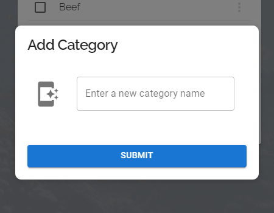
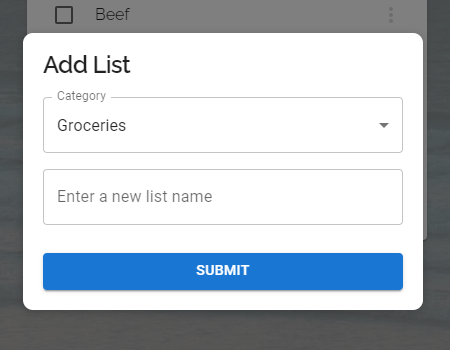
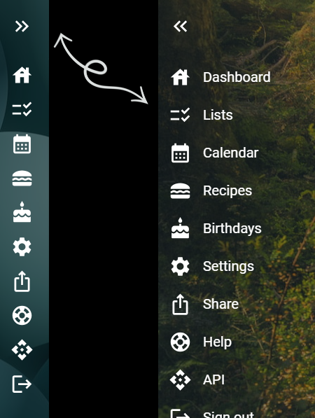
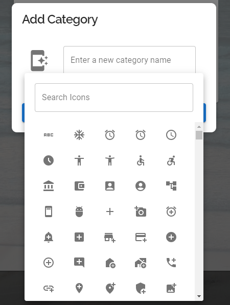
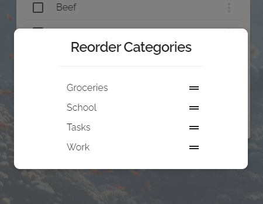
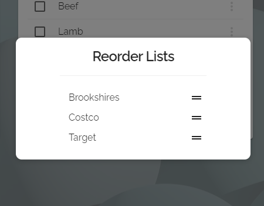

<a name="readme-top"></a>

<!-- PROJECT SHIELDS -->

[![MIT License][license-shield]][license-url]
[![LinkedIn][linkedin-shield]][linkedin-url]

<!-- TABLE OF CONTENTS -->

<details>-*
  <summary>Table of Contents</summary>
  <ol>
    <li>
      <a href="#about-the-project">About The Project</a>
      <ul>
        <li><a href="#built-with">Built With</a></li>
      </ul>
    </li>
    <li>
      <a href="#getting-started">Getting Started</a>
      <ul>
        <li><a href="#prerequisites">Prerequisites</a></li>
        <li><a href="#installation">Installation</a></li>
      </ul>
    </li>
    <li><a href="#usage">Usage</a></li>
    <li><a href="#roadmap">Roadmap</a></li>
    <li><a href="#contributing">Contributing</a></li>
    <li><a href="#license">License</a></li>
    <li><a href="#contact">Contact</a></li>
    <li><a href="#acknowledgments">Acknowledgments</a></li>
  </ol>
</details>

<!-- ABOUT THE PROJECT -->

## About The Project

[![Product Name Screen Shot][product-screenshot]][product-screenshot]

There are many great organizers available throughout the interwebs but there's always features that one handles better than the other or something so miniscule that none of them have or are willing to entertain adding (such as timestamps on entries I can use to settle arguments with the wife). While bustling with code for fun and trying to decide on a personal side project to get into, the light went off. This would be the perfect real world project to tackle that I could build off of for years to come and add those little minute features I want -- starting with an audit of EVERYTHING.

Here's my main feature goals:

- Lists. Lists. Lists

  - Did I mention lists? I love lists. In fact, I decided it would only be logical to start on lists before any of the other features because 90% of the remaining features would utilize the same components in some way.

- Recipes

  - My family has been trying to take a healthier approach and we've discovered it's really difficult to get away from the grimey way of life. We need an organizer of recipes we can quickly refer to. We often find recipes online and modify them in a healthy way but forget to write it down. When we do get them written down, they get stored in emails or Google Drive. It would just be a nice feature to have quick access to.

- Calendars

  - We have great options with Google and integrations with Android and iPhone but it would just be nice to have everything in one place.

- Birthdays!

  - This one isn't as important as Lists or Recipes and will likely be tied into Calendar but my wife has some specific ideas of what she'd like to have, especially when it comes to keeping up with our daughter's friend's birthdays.

Of course, the issue will always remain - what's great for me may not be great for you. Maybe you want to build on my idea of a "yet another family organizer". My main features listed will most definetely expand in the near future as I begin building out. Please, if you have suggestions or want to chip in, fork the repo, create a pull request or open an issue!

<p align="right">(<a href="#readme-top">back to top</a>)</p>

### Built With

Here's the current major frameworks/libraries I'm working with in the project so far. This may change.

- [![Next][Next.js]][Next-url]
- [![React][React.js]][React-url]
- [![Material UI][MUI]][MUI-url]
- [![MySQL][MySQL]][MySQL-url]
- [![Sass][Sass]][SASS-url]

<p align="right">(<a href="#readme-top">back to top</a>)</p>

<!-- GETTING STARTED -->

## Getting Started

To get a local copy up and running follow these simple example steps.

### Prerequisites

- npm
  ```sh
  npm install npm@latest -g
  ```

### Installation

1. Clone the repo
   ```sh
   git clone https://github.com/leoashcraft/Personal-Family-Organizer.git
   ```
2. Install NPM packages
   ```sh
   npm install
   ```
3. Setup MySQL server
   - Setup a database to be used for this project
   - Import database.sql contents into database
       - **Please note:** User creation has not yet been implemented, see Lines 18 - 22 to set a username/password.
4. Setup **.env** in root directory of app
   - There's a sample env in the repo but for reference
5. Compile and run development server
   ```sh
   npm run dev
   ```
   
<p align="right">(<a href="#readme-top">back to top</a>)</p>

<!-- USAGE EXAMPLES -->

## Usage

<table>
  <tr>
    <td></td>
    <td></td>
  </tr>
  <tr>
    <td></td>
    <td></td>
  </tr>
  <tr>
    <td></td>
    <td></td>
  </tr>
</table>
<table>
  <tr>
    <td></td>
  </tr>
</table>

<p align="right">(<a href="#readme-top">back to top</a>)</p>

<!-- ROADMAP -->

## Roadmap

- [x] User login
- [ ] User sign up
- [x] Sidebar
- [x] Lists
  - [x] Add Categories Modal
  - [x] Add Categories Icon Selector
  - [x] Add Lists Modal
  - [x] Add List Items Field
  - [x] Reorganize Categories Modal
  - [x] Reoganize Lists Modal
  - [x] Reorganize List Items Inline
  - [ ] Item Details Modal
  - [ ] Delete Categories
    - [ ] Delete Confirmation Alert
  - [ ] Delete Lists
    - [ ] Delete Confirmation Alert
  - [ ] Delete List Items
    - [ ] Delete Confirmation Alert
- [ ] Recipes
  - [ ] Breakdowns to be added.
- [ ] Calendars
  - [ ] Breakdowns to be added.
- [ ] Birthdays
  - [ ] Breakdowns to be added.
- [ ] API
  - [x] Lists API
  - [x] Recipes API
  - [ ] Calendars API
  - [ ] Birthdays API
  - [ ] Settings API
- [ ] Settings
  - [ ] Account Settings
  - [ ] Theme/Styling Settings
- [ ] Mobile styling

<p align="right">(<a href="#readme-top">back to top</a>)</p>

<!-- CONTRIBUTING -->

## Contributing

Contributions are what make the open source community such an amazing place to learn, inspire, and create. Any contributions you make are **greatly appreciated**.

If you have a suggestion that would make this better, please fork the repo and create a pull request. You can also simply open an issue with the tag "enhancement".
Don't forget to give the project a star! Thanks again!

1. Fork the Project
2. Create your Feature Branch (`git checkout -b feature/AmazingFeature`)
3. Commit your Changes (`git commit -m 'Add some AmazingFeature'`)
4. Push to the Branch (`git push origin feature/AmazingFeature`)
5. Open a Pull Request

<p align="right">(<a href="#readme-top">back to top</a>)</p>

<!-- LICENSE -->

## License

Distributed under the MIT License. See `LICENSE.txt` for more information.

<p align="right">(<a href="#readme-top">back to top</a>)</p>

<!-- CONTACT -->

## Contact

Leo Ashcraft - [LinkedIn](https://www.linkedin.com/in/leo3/) - leo@ashcraft.tech

Project Link: [https://github.com/leoashcraft/Personal-Family-Organizer](https://github.com/leoashcraft/Personal-Family-Organizer)

<p align="right">(<a href="#readme-top">back to top</a>)</p>

<!-- ACKNOWLEDGMENTS -->

## Acknowledgments

- [Best-README-Template - An awesome README template to jumpstart your projects!](https://github.com/othneildrew/Best-README-Template)

<p align="right">(<a href="#readme-top">back to top</a>)</p>

<!-- MARKDOWN LINKS & IMAGES -->
<!-- https://www.markdownguide.org/basic-syntax/#reference-style-links -->

[license-shield]: https://img.shields.io/github/license/othneildrew/Best-README-Template.svg?style=for-the-badge
[license-url]: https://github.com/leoashcraft/Personal-Family-Organizer/blob/master/LICENSE.TXT
[linkedin-shield]: https://img.shields.io/badge/-LinkedIn-black.svg?style=for-the-badge&logo=linkedin&colorB=555
[linkedin-url]: https://www.linkedin.com/in/leo3/
[product-screenshot]: public/github-screenshots/lists.png
[Next.js]: https://img.shields.io/badge/next.js-000000?style=for-the-badge&logo=nextdotjs&logoColor=white
[Next-url]: https://nextjs.org/
[React.js]: https://img.shields.io/badge/React-20232A?style=for-the-badge&logo=react&logoColor=61DAFB
[React-url]: https://reactjs.org/
[Vue.js]: https://img.shields.io/badge/Vue.js-35495E?style=for-the-badge&logo=vuedotjs&logoColor=4FC08D
[Vue-url]: https://vuejs.org/
[MUI]: https://img.shields.io/badge/Material%20UI-007FFF?style=for-the-badge&logo=mui&logoColor=black
[MUI-url]: https://vuejs.org/
[MySQL]: https://img.shields.io/badge/mysql-3E6E93?style=for-the-badge&logo=mysql&logoColor=black
[MySQL-url]: https://mysql.com/
[Sass]: https://img.shields.io/badge/SASS-BF4080?style=for-the-badge&logo=sass&logoColor=white
[Sass-url]: https://sass-lang.com/
